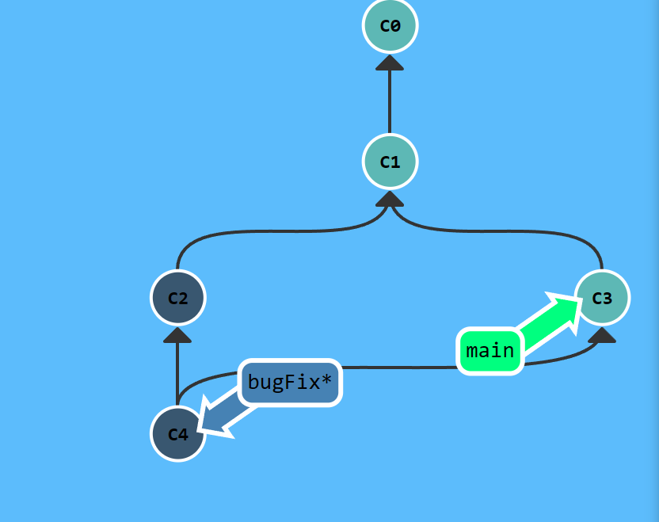
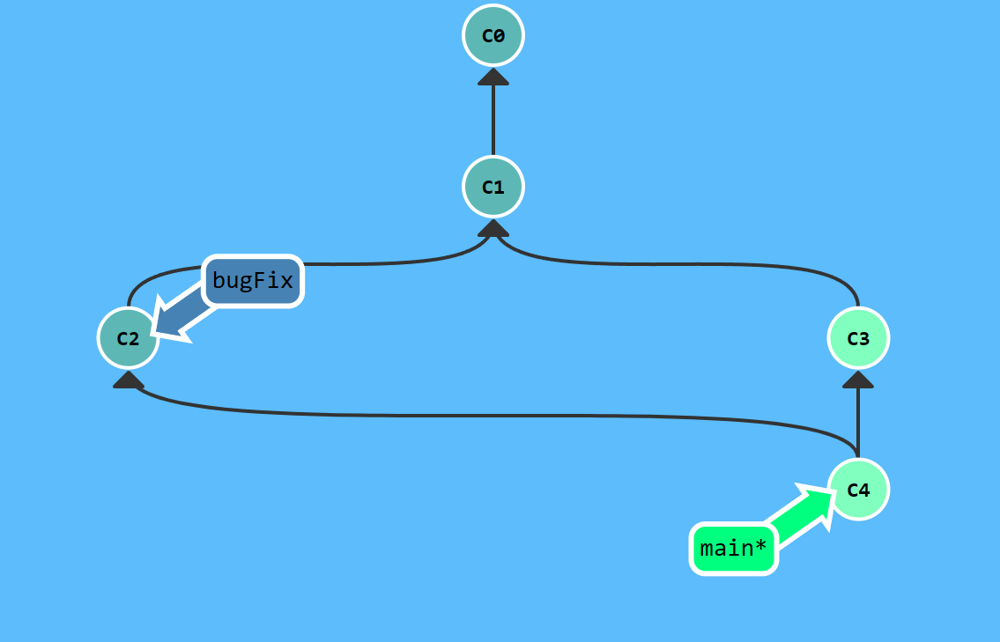

## commit and checkout

commit是提交代码,产生一次commit指向父commit，checkout是切换分支

## merge

```bash
git merge <branch> # 将branch分支合并到当前分支
```

merge会产生一次新的commit，指向两个父commit





merge的优势在于保留了每个merge的完整历史记录，缺点是每次merge都会多产生一个commit，如果分支较多，历史记录会变得很复杂
